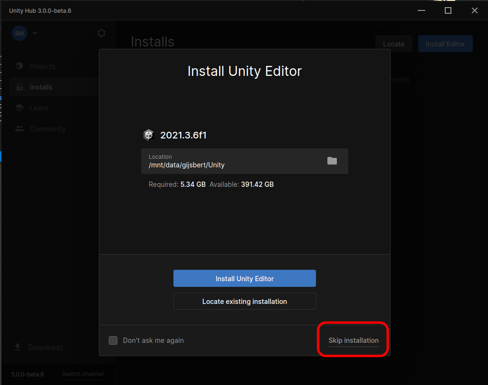
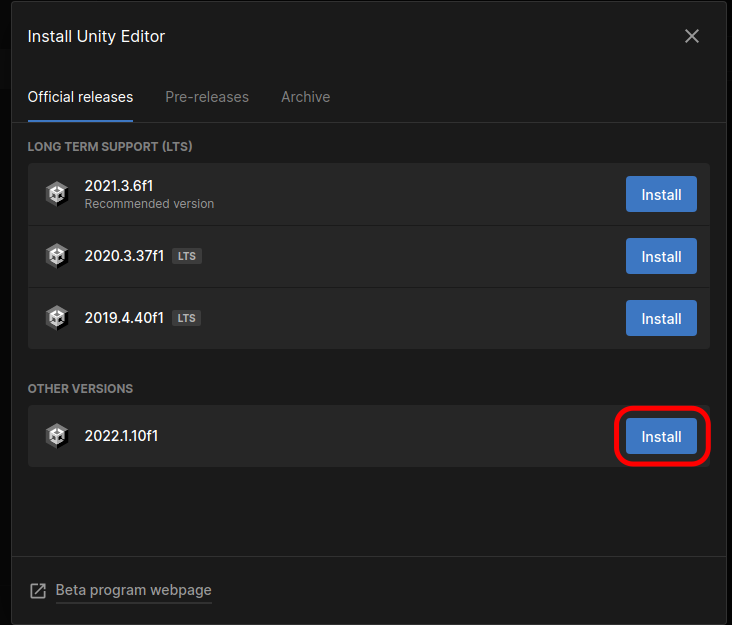
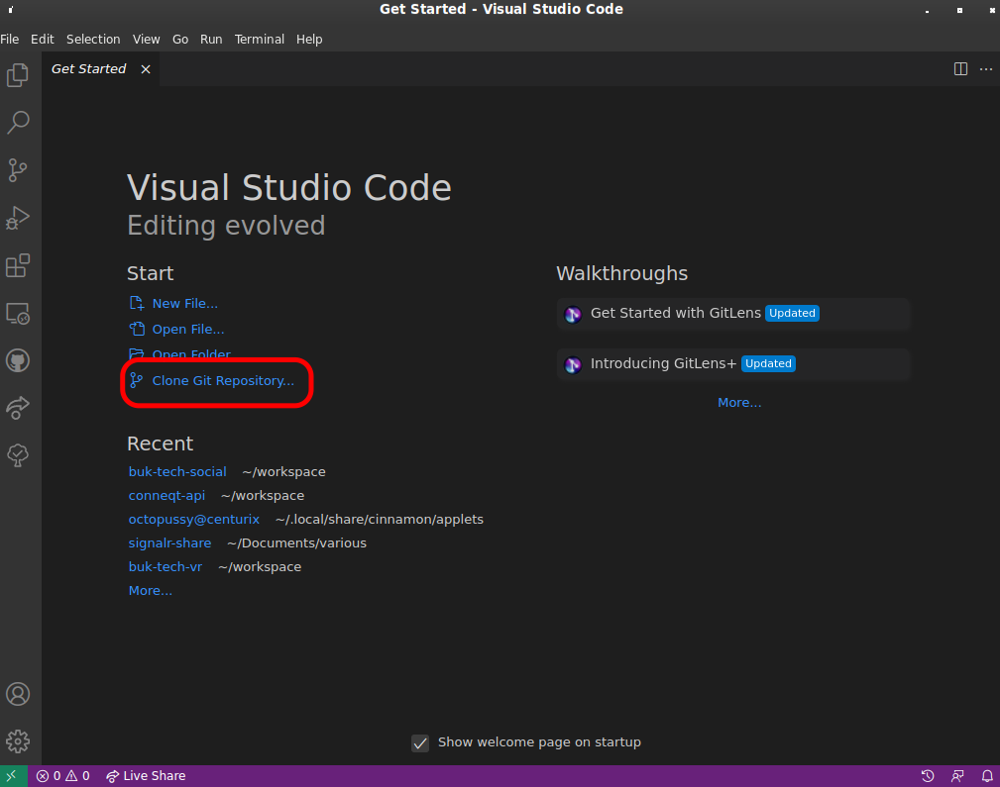

# BUK Tech Social

Social game development at BUK Sommercamp 2022

## Setting up the environment

### Download and install Visual Studio Code

1. Download Visual Studio Code (VSCode) https://code.visualstudio.com/

**Note:** Do _not_ install Visual Studio! That's a different program.

### Download and install git

#### On Windows

1. Download git from the following link: https://git-scm.com/downloads
2. Follow the instructions from the downloaded file.
3. When asked what your git editor should be, select VSCode.
4. When asked whether git should be added to your PATH, make sure you that option is set.

#### On MacOS
1. Open terminal and run `brew install git`

#### On Linux

Install it using your package manager. On Debian based systems including Ubuntu or Mint you can run `sudo apt install git` in terminal

### Download and install Unity

1. Download Unity hub - https://unity3d.com/get-unity/download
2. Open Unity hub
3. Skip the recommended install: 
4. Install the latest 2022 version. (Apple Silicon users, see next screenshot below this one)   
  **NOTE:** If you use an Apple Silicon MacOS, you must use the Unity Hub Beta version (enable beta inside Unity Hub) to find Unity 2022 in the list of available installs. Then you must select the Silicon version, not the Intel version 

### Clone the git repository

1. Open VSCode
2. Click the _Clone Git Repository button_: 
3. Enter this URI: `https://github.com/bcc-code/buk-tech-social.git`

### Load the project in Unity using Unity Hub

Press the play button to play-test the scene and see whether it works.
